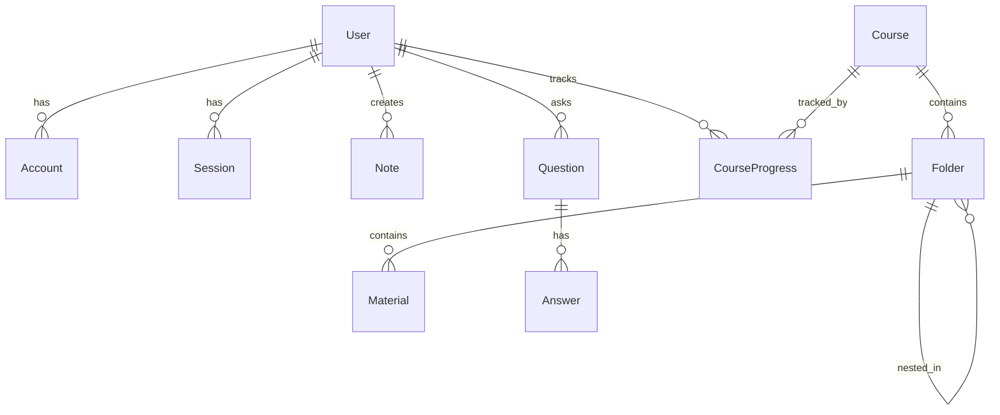

# Newcode AI Consulting Website - System Architecture Document

## Project Overview

### Business Context
Newcode is a pioneering AI consulting firm focused on agentic programming education and training. The company transforms non-technical professionals (project managers, analysts, entrepreneurs) into application creators through AI agent communication training. The website serves as the primary digital platform for the Quebec/Canadian market with a French-first approach.

**Company Mission**: Help freelancers, startup teams, and technical agencies tackle the real bottleneck in software development: understanding what to build.

**Target Market**: Teams looking to increase output without scaling headcount, with focus on "wannabe coders" (codeurs malgré eux) - professionals who need structured guidance from ideation to production-ready applications.

### Project Scope
Full-stack web application serving as:
- Marketing website for training programs
- User authentication and management system
- Course content delivery platform
- Payment processing integration
- Student community features (Q&A, notes)
- Bilingual content management (French-first, English secondary)

## Technical Stack

### Frontend Architecture
- **Framework**: Next.js 15.3.4 with App Router
- **Runtime**: React 19.0.0
- **Language**: TypeScript 5.x
- **Styling**: Tailwind CSS 4.x
- **Animations**: Framer Motion 12.19.1
- **Icons**: Lucide React 0.523.0, Radix UI Icons 1.3.2
- **Theming**: next-themes 0.4.6

### Backend & API
- **Runtime**: Node.js with Next.js API Routes
- **Authentication**: NextAuth.js 4.24.11 with Prisma adapter
- **Database ORM**: Prisma 6.11.1
- **Password Hashing**: bcryptjs 3.0.2
- **JWT**: jsonwebtoken 9.0.2

### Database
- **Primary Database**: PostgreSQL
- **ORM**: Prisma with automatic client generation
- **Connection Management**: Prisma Client with connection pooling

### Internationalization
- **Framework**: next-intl 4.3.7
- **Default Locale**: French (fr)
- **Secondary Locale**: English (en)
- **Routing Strategy**: As-needed locale prefix

### Deployment & Infrastructure
- **Platform**: Vercel
- **Build System**: Next.js static optimization
- **CDN**: Vercel Edge Network
- **Domain**: new-code.ca

### Payment Processing
- **Provider**: Stripe (external integration)
- **Implementation**: Direct payment links
- **Pricing Models**: One-time payments and installment plans

## System Architecture

### High-Level Architecture

```
┌─────────────────────────────────────────────────────────────┐
│                    Vercel Edge Network                      │
│                     (CDN + Hosting)                        │
└─────────────────────┬───────────────────────────────────────┘
                      │
┌─────────────────────┴───────────────────────────────────────┐
│                  Next.js Application                       │
│  ┌─────────────────┐  ┌─────────────────┐  ┌──────────────┐ │
│  │   App Router    │  │   API Routes    │  │ Middleware   │ │
│  │                 │  │                 │  │              │ │
│  │ • SSR/SSG Pages │  │ • Auth APIs     │  │ • i18n       │ │
│  │ • Client Comp.  │  │ • Course APIs   │  │ • Auth       │ │
│  │ • Server Comp.  │  │ • Notes APIs    │  │ • Routing    │ │
│  └─────────────────┘  └─────────────────┘  └──────────────┘ │
└─────────────────────┬───────────────────────────────────────┘
                      │
┌─────────────────────┴───────────────────────────────────────┐
│                    Data Layer                              │
│  ┌─────────────────┐  ┌─────────────────┐  ┌──────────────┐ │
│  │   PostgreSQL    │  │   NextAuth.js   │  │    Stripe    │ │
│  │                 │  │                 │  │              │ │
│  │ • User Data     │  │ • Sessions      │  │ • Payments   │ │
│  │ • Course Data   │  │ • Accounts      │  │ • Webhooks   │ │
│  │ • Progress      │  │ • Tokens        │  │ • Billing    │ │
│  └─────────────────┘  └─────────────────┘  └──────────────┘ │
└─────────────────────────────────────────────────────────────┘
```

### Application Structure

```
src/
├── app/                          # Next.js App Router
│   ├── [locale]/                # Internationalized routes
│   │   ├── auth/                # Authentication pages
│   │   ├── formation-kickstart/ # Training program pages
│   │   ├── formation/           # Course content
│   │   ├── dashboard/           # User dashboard
│   │   ├── notes/               # Note-taking system
│   │   ├── questions/           # Q&A system
│   │   └── parcours/            # Learning paths
│   ├── api/                     # API endpoints
│   │   ├── auth/                # Authentication APIs
│   │   ├── courses/             # Course management
│   │   ├── notes/               # Notes CRUD
│   │   └── questions/           # Q&A system
│   └── globals.css              # Global styles
├── components/                   # Reusable components
│   ├── auth/                    # Authentication components
│   ├── layout/                  # Layout components
│   ├── sections/                # Page sections
│   └── ui/                      # UI primitives
├── hooks/                       # Custom React hooks
├── lib/                         # Utilities and configurations
├── messages/                    # i18n translations
├── types/                       # TypeScript definitions
└── utils/                       # Utility functions
```

## Data Architecture

### Database Schema Overview

The database schema is designed to support a comprehensive learning management system with user authentication, course content delivery, and community features.

#### Core Entities

**User Management**
- `User`: Core user profiles with role-based access
- `Account`: OAuth provider accounts (NextAuth)
- `Session`: Active user sessions
- `VerificationToken`: Email verification tokens

**Course System**
- `Course`: Main course entities with pricing
- `Folder`: Hierarchical content organization
- `Material`: Individual learning materials (videos, documents, quizzes)
- `CourseProgress`: User progress tracking

**Community Features**
- `Note`: User-generated notes (private/shared)
- `Question`: Q&A system for student support
- `Answer`: Responses to questions (official/community)

#### Key Relationships



#### Enums and Business Logic

**User Roles**
- `USER`: Standard student access
- `ADMIN`: Full system administration
- `INSTRUCTOR`: Course creation and management

**Subscription Tiers**
- `FREE`: Basic access level
- `PREMIUM`: Enhanced course access
- `ENTERPRISE`: Full feature access

**Material Types**
- `VIDEO`: Video content
- `DOCUMENT`: PDF/text materials
- `AUDIO`: Audio content
- `IMAGE`: Visual materials
- `LINK`: External resources
- `QUIZ`: Interactive assessments

### Data Flow Architecture

**Authentication Flow**
1. User registration/login via NextAuth.js
2. Session creation and management
3. Role-based access control
4. Prisma adapter for session persistence

**Course Access Flow**
1. User enrollment verification
2. Progress tracking initialization
3. Content delivery based on subscription tier
4. Progress updates and completion tracking

**Payment Integration Flow**
1. Stripe payment link generation
2. External payment processing
3. Webhook-based enrollment activation
4. Subscription status updates

## Security Architecture

### Authentication & Authorization

**NextAuth.js Configuration**
- Multiple provider support (email, OAuth)
- Secure session management with JWT
- CSRF protection enabled
- Prisma adapter for session persistence

**Password Security**
- bcryptjs hashing with salt rounds
- Secure password requirements
- Password reset functionality
- Account lockout protection

**Role-Based Access Control (RBAC)**
- User, Admin, Instructor roles
- Route-level protection
- API endpoint authorization
- Component-level access control

### Data Protection

**Database Security**
- Connection string environment variables
- Prisma query parameterization (SQL injection protection)
- Row-level security policies
- Encrypted sensitive data fields

**Session Management**
- Secure HTTP-only cookies
- Session timeout policies
- Concurrent session limits
- Session invalidation on logout

**API Security**
- JWT token validation
- Rate limiting implementation
- Input validation and sanitization
- CORS policy configuration

### Payment Security

**Stripe Integration**
- PCI compliance through Stripe
- Secure webhook handling
- Payment data isolation
- Fraud detection integration

## Performance Architecture

### Frontend Optimization

**Next.js Optimizations**
- Static Site Generation (SSG) for marketing pages
- Server-Side Rendering (SSR) for dynamic content
- Automatic code splitting
- Image optimization with next/image

**Bundle Optimization**
- Tree shaking for unused code
- Dynamic imports for heavy components
- CSS optimization with Tailwind purging
- Font optimization and preloading

**Caching Strategy**
- Static asset caching via Vercel CDN
- API response caching
- Browser caching headers
- Service worker implementation (future)

### Backend Performance

**Database Optimization**
- Prisma query optimization
- Connection pooling
- Index optimization
- Query caching strategies

**API Performance**
- Response compression
- Efficient data fetching patterns
- Background job processing (future)
- Database query optimization

### Monitoring & Analytics

**Performance Monitoring**
- Vercel Analytics integration
- Core Web Vitals tracking
- API response time monitoring
- Error tracking and logging

## Scalability Architecture

### Horizontal Scaling Considerations

**Database Scaling**
- PostgreSQL connection pooling
- Read replica potential
- Database sharding strategies (future)
- Caching layer implementation

**Application Scaling**
- Vercel serverless function scaling
- Edge function deployment
- CDN optimization
- Load balancing (automatic via Vercel)

### Growth Accommodation

**User Base Growth**
- Subscription tier management
- Content delivery optimization
- Community feature scaling
- Payment processing scaling

**Content Scaling**
- File storage optimization
- Video streaming integration (future)
- Content delivery network
- Multi-language content management

## Integration Architecture

### Third-Party Integrations

**Stripe Payment Processing**
- Direct payment link integration
- Webhook event handling
- Subscription management
- Invoice generation

**Authentication Providers**
- Email/password authentication
- OAuth provider support (extensible)
- Social login integration (future)
- Single Sign-On capabilities

### API Architecture

**RESTful API Design**
- Resource-based endpoints
- HTTP method conventions
- Status code standards
- Error response formatting

**API Endpoints Structure**
```
/api/auth/          # Authentication endpoints
/api/courses/       # Course management
/api/notes/         # Note-taking system
/api/questions/     # Q&A system
/api/users/         # User management
```

## Internationalization Architecture

### Language Strategy

**French-First Approach**
- Default locale: French (fr)
- Primary market: Quebec/Canada
- URL structure: root domain serves French
- English accessible via /en prefix

**Translation Management**
- next-intl for client/server translations
- JSON translation files (fr.json, en.json)
- Component-level translation keys
- Fallback translation strategy

**Content Localization**
- Marketing content translation
- Course material localization
- Email template translation
- Error message localization

### Routing Strategy

**Locale-Aware Routing**
- Automatic locale detection
- Cookie-based locale persistence
- URL prefix management (as-needed)
- SEO-friendly URL structure

## Business Logic Architecture

### Training Program Structure

**Formation Kickstart (€280)**
- Beginner-level training
- 10 modules curriculum
- 6-hour total duration
- Bolt/Lovable tool focus
- 3x payment option available

**Formation Architecte (€3200)**
- Advanced training program
- 6 modules curriculum
- 6-hour total duration
- Complex application development
- Installment payment options

### User Journey Architecture

**Progressive Learning Path**
1. **Awareness**: Landing page with value proposition
2. **Interest**: Detailed formation pages
3. **Consideration**: Parcours overview and comparison
4. **Decision**: Payment integration and enrollment
5. **Onboarding**: Dashboard and course access
6. **Learning**: Content delivery and progress tracking
7. **Community**: Q&A system and note-taking
8. **Advanced**: Upsell to higher-tier programs

### Business Model Integration

**Revenue Streams**
- Direct course payments via Stripe
- Subscription-based content access
- Enterprise training programs
- Consulting services

**Customer Segments**
- Tech students and junior developers
- Business school graduates
- Data professionals and analysts
- Web designers and frontend developers
- Freelancers and automation specialists

## Deployment Architecture

### Vercel Platform Integration

**Build Configuration**
- Next.js framework detection
- Automatic dependency installation
- Prisma client generation
- TypeScript compilation

**Environment Management**
- Production environment variables
- Database connection strings
- Authentication secrets
- Stripe API keys

**Performance Optimization**
- Edge function deployment
- Global CDN distribution
- Automatic HTTPS
- Performance monitoring

### CI/CD Pipeline

**Development Workflow**
1. Local development with hot reload
2. Git-based version control
3. Automatic Vercel deployments
4. Preview deployments for branches
5. Production deployment automation

**Quality Assurance**
- ESLint code quality checks
- TypeScript type checking
- Translation validation
- Build verification

## Risk Management & Disaster Recovery

### Security Risks

**Data Protection**
- User data encryption
- Payment information security
- Authentication token protection
- Database access control

**Application Security**
- Input validation
- SQL injection prevention
- XSS protection
- CSRF token implementation

### Business Continuity

**Backup Strategy**
- Database backup automation
- Configuration backup
- Code repository redundancy
- Recovery procedures

**Monitoring & Alerting**
- Application health monitoring
- Error tracking and alerting
- Performance degradation alerts
- Security incident detection

## Future Architecture Considerations

### Planned Enhancements

**Technical Improvements**
- Advanced caching implementation
- Service worker for offline capability
- Real-time features with WebSockets
- Advanced analytics integration

**Business Feature Expansion**
- Mobile application development
- Advanced course authoring tools
- Live streaming integration
- AI-powered personalization

### Scalability Roadmap

**Phase 1**: Current architecture optimization
**Phase 2**: Advanced caching and CDN
**Phase 3**: Microservices consideration
**Phase 4**: Multi-region deployment

## Documentation & Maintenance

### Technical Documentation

**Code Documentation**
- TypeScript interfaces and types
- Component documentation
- API endpoint documentation
- Database schema documentation

**Operational Documentation**
- Deployment procedures
- Environment setup guides
- Troubleshooting guides
- Performance optimization guides

### Maintenance Strategy

**Regular Updates**
- Dependency security updates
- Framework version upgrades
- Database schema migrations
- Performance optimization reviews

**Monitoring & Metrics**
- Application performance metrics
- User engagement analytics
- Business conversion tracking
- Technical debt assessment

---

**Document Version**: 1.0  
**Last Updated**: September 26, 2024  
**Next Review**: December 2024

This architecture document serves as the comprehensive technical guide for the Newcode AI Consulting Website, supporting the business mission of transforming professionals into application creators through structured agentic programming education.